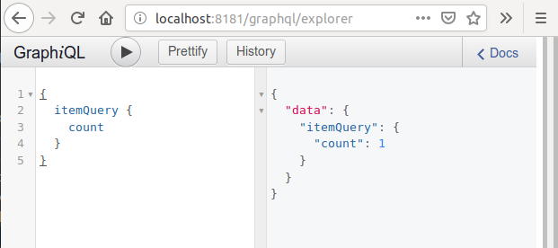

GraphQL
=======

参考：
[Drupal document](https://www.drupal.org/docs/8/modules/graphql)

## 调试工具

* **GraphiQL**:
访问地址/graphql/explorer进入GraphiQL，在左边录入json，右边查看结果：


* **curl**:
```
curl -X POST -H "Content-Type: application/json" \
--data '{ "query": "{ itemQuery { count }}"}' \
-b "SESS49960de5880e8c687434170f6476605b=UjxSlOzyS6kYXr7dijmP8f4U1mtC-bVDmS-g9Zrccvc" \
http://localhost:8181/graphql
```
