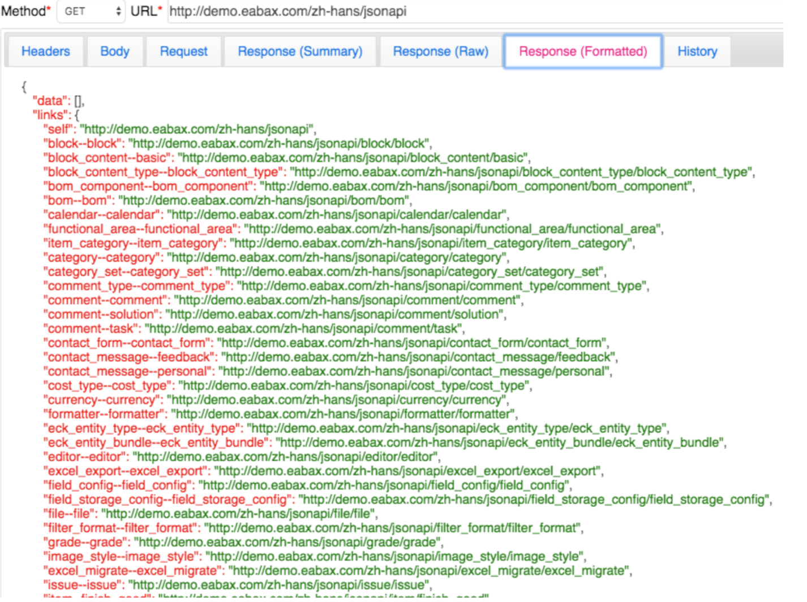

JSON API
========

参考：[Drupal document](https://www.drupal.org/docs/8/modules/jsonapi)

## JSON:API 基础功能示例
本节描述了eAbax公共接口开发过程. 公共数据接口地址是: `~/zh-hans/jsonapi`或`~/jsonapi/`, 波浪号使用直接的主机名替换。
## 获取json数据接口列表(获得entity type(实体类型)列表)
使用上面的接口地址获取平台系统的可获得实体类型和bundle列表所有接口数据

links中每一项为"entity_type_id--bundle"。例如"organization--company"，其中organization是实体名称，company是bundle名称。
如下图所示:



1. 获取单个实体类型数据列表
以organization/company为例，获取接口数据如下:
2. 创建organization实体数据
此时，待提交的地址如: `http://demo.eabax.com/zh-hans/jsonapi/organization/company`; 数据如下:
```
{
  "data": {
  "type": "organization--company",
  "attributes": {
      "name": '新测试组',
      "description": '临时测试组',
    }
  }
}
```
3. 获取单个实体的数据
获取单个实体数据的地址如: `~/zh-hans/jsonapi/organization/company/b6b624fe-6a92-4c32-a82f-6f658c95e484`, company后面的字符串为organization的ID(UUID)值:
4. 对单个数据进行更新、删除
使用PATCH方法，对Organization进行更新:
```
{
   "data": {
   "type": "organization--company",
   "id": "b6b624fe-6a92-4c32-a82f-6f658c95e484",
   "attributes": {
       "id": 1,
       "uuid": "b6b624fe-6a92-4c32-a82f-6f658c95e484",
       "langcode": "en",
       "name": "Change to your organization name",
       "description": "dfddddd"
       }
   }
}
```
dfddddd为即将更新的数据，如图所示:
删除操作使用DELETE方法，其他相同。

## JSON:API 高级文档部分
1. [JSON:API](jsonapi/jsonapi.md)  JSON:API模块完全兼容JSON:API规范。
2. [JSON:API术语](jsonapi/jsonapi_terms.md) 常见JSON:API术语及其含义
3. [JSON:API概览](jsonapi/jsonapi_overview.md)
4. [JSON:API核心概念](jsonapi/jsonapi_concepts.md)
5. [JSON:API过滤器](jsonapi/jsonapi__filtering.md)
6. [JSON:API包含](jsonapi/jsonapi_include.md)
7. [JSON:API分页](jsonapi/jsonapi_pagination.md)
8. [JSON:API排序](jsonapi/jsonapi_sort.md)
9. [JSON:API版本](jsonapi/jsonapi_revision.md)
10. [JSON:API创建资源](jsonapi/jsonapi_post.md)
11. [JSON:API获取资源](jsonapi/jsonapi_get.md)
12. [JSON:API-GET,POST,PATCH,DELETE](jsonapi/jsonapi_crud.md)
13. [JSON:API-DELETE](jsonapi/jsonapi_delete.md)
14. [JSON:API-PATCH](jsonapi/jsonapi_patch.md)
15. [上传文件](jsonapi/jsonapi_upload.md)
16. [JSON:API和核心REST模块的对比](jsonapi/jsonapi_difference.md) 如果您有要公开的非实体数据，请选择REST。在所有其他情况下，选择JSON:API。
17. [JSON:API不能做什么](jsonapi/jsonapi_what_no_do.md) 创建帐户、登录和请求新密码等业务规则不是json:api的一部分。