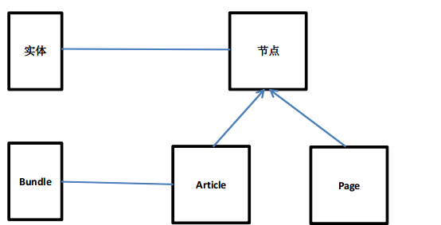
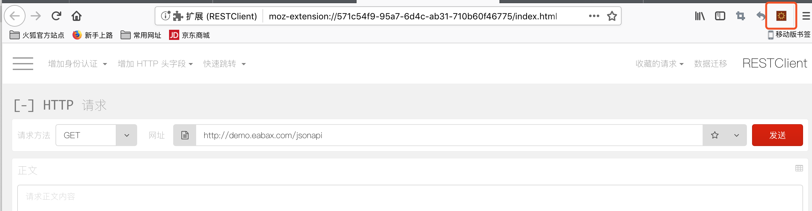
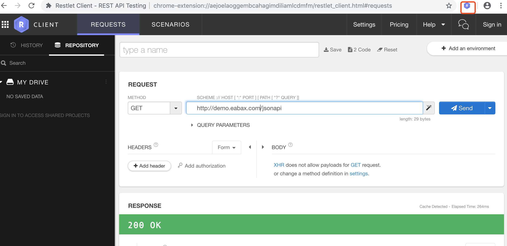
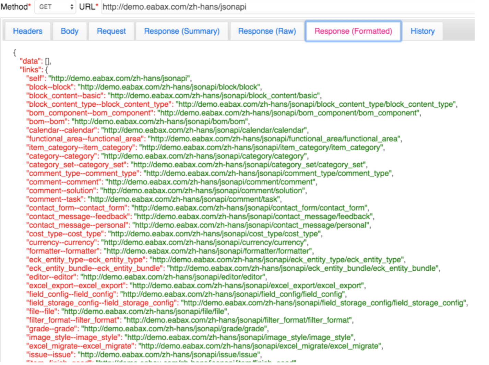

API Guide(平台接口指南)
=====================

## 基本概念

* **标准接口**:
云平台支持三种接口标准：[RESTful](RESTful.md)、[JSON API](JSONAPI.md)、[GraphQL](GraphQL.md)

* **接口地址**:
接口开发测试地址，统一使用`http://demo.eabax.com`.

* **Entity(实体)**:
系统数据以Entity(实体)的方式存在。
实体具有相同属性，并且可以为它添加字段的一种东西。
当然，有些实体，是不能够向它们上面添加字段的，这种情况也是存在的。
当我们定义一种实体的时候,可以为它定义一组公用的属性.

* **Bundle**:
伴随着，实体的出现，还出现了另一个概念，Bundle，中文可以翻译为“包”。
什么是Bundle呢，我们可把它看作，一种实体下面的一个具体实现。以节点为例：



Drupal核心内置的两种内容类型: Article、Page,就是一种Bundle。
我们可以把Bundle看作，是Drupal下面对内容类型的一种概念上的扩展。
对于分类来讲，一个词汇表，就是一个Bundle。

在同一种实体下面，不同Bundle之间，它们的属性是通用的，但是可以有不同的默认配置；
它们的字段，则可以分别添加，
不同的Bundle，可以为其添加不同的字段，
当然两个Bundle，我们为其添加了相同的字段，这也是允许的。

## 接口测试工具

### Firefox

需要安装restclient插件,如图:


### Chrome

需要安装restlet client插件，此插件位于`Development Guide/plugins目录下的`chrome_Restlet-Client....`.
完成后如图:


## 获得entity type(实体类型)列表

通过[jsonapi](JSONAPI.md)接口可获得实体类型和bundle列表，访问路径：`/jsonapi`

links中每一项为"entity名称--bundle名称"。例如"organization--company"，其中organization是实体名称，company是bundle名称。
 
通过JSON API获得实体类型列表：



## 用户登陆

## 获取特定实体类型的列表

(TODO：获得实体类型所有bundle的数据)
以organization/company为例，获取接口数据如下: `/jsonapi/organization/company`

## Entity查看、添加、删除、修改

#### 1. 创建实体数据
此时，待提交的地址如: `/jsonapi/organization/company`; 使用`POST`方式提交，数据如下:
```
{
  "data": {
  "type": "organization--company",
  "attributes": {
      "name": '新测试组',
      "description": '临时测试组',
    }
  }
}
```


#### 3. 获取单个实体数据方式
获取单个实体数据的地址如: `/jsonapi/organization/company/b6b624fe-6a92-4c32-a82f-6f658c95e484`, 
company后面的字符串为organization的ID(UUID)值:

#### 4. 对单个数据进行更新、删除
使用PATCH方法，对Organization进行更新:
```
{
   "data": {
   "type": "organization--company",
   "id": "b6b624fe-6a92-4c32-a82f-6f658c95e484",
   "attributes": {
       "id": 1,
       "uuid": "b6b624fe-6a92-4c32-a82f-6f658c95e484",
       "langcode": "en",
       "name": "Change to your organization name",
       "description": "dfddddd"
       }
   }
}
```
dfddddd为即将更新的数据，如图所示:
删除操作使用DELETE方法，其他相同。


