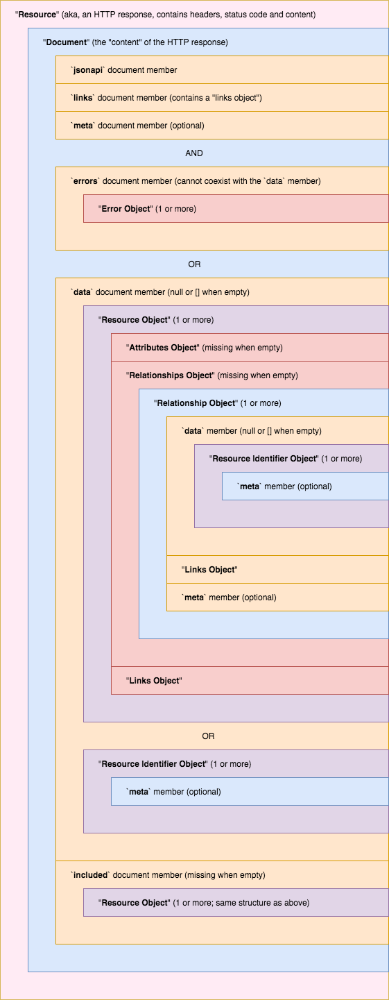

JSON API 术语
===========

* HTTP请求是被发送到json:api资源，不要将它们与资源对象(resource object)混淆。
* 客户机接收的JSON对象(JSON Object)称为文档(document)。
* 文档(document)始终是JSON对象(JSON Object)，在数据(data)键下是主要数据内容。
* (data键)下的数据称为资源对象或资源标识符对象。
* 当您请求相关数据嵌入到文档(data)中时，它将成为一个复合文档。
* 复合文档是在顶级对象中具有(include)键的文档(document)。
* 返回的许多资源对象的资源称为集合资源。
* 返回一个资源对象的资源称为单个资源。
* 返回关于资源对象之间关系信息的资源称为关系资源。
* Drupal 术语:
  * 资源对象 即为 实体
  * 资源标识符对象 即为 实体引用字段项(Entity reference field items)
  * 文档(Document) 即为 Request/response JSON payload.

下面简要描述了描述json:api模块时使用的术语和概念。
这个术语表与[JSON:API标准规范](http://jsonapi.org/format/)非常相似，但是它试图在定义应用于drupal时对其进行框架定义。它还扩展了规范的细微之处，对于不熟悉规范或[如何阅读规范](https://www.mnot.net/blog/2018/07/31/read_rfc)的新手来说，这些细微之处可能并不明显。

其中许多定义相互交织在一起。本页底部有一个图表，将这些术语放入它们出现的上下文中。

* Resource(资源)
可以获取json:api响应文档的路径,资源可以通过其URL找到.它不应该与“资源对象”混淆.资源和应用程序数据没有一一对应关系.

在Drupal术语中，这意味着json:api资源不是实体的同义词.相反，资源是一个可以检索概念数据的地方.

例如，这个概念可以是“node--article类型的资源对象的集合”，也可以是“特定`article node`引用字段`field_tags`的一个表述。"
1. Response Document(文档)
从json:api资源返回的json编码响应体.它是一个“数据包”,包含传送到HTTP客户机的数据或错误.它有时引用的是顶级对象。当这个返回对象包含文档成员时，它又被称为复合文档。
* Compound Document(复合文档)
复合文档是包含所有文档成员的响应文档。通过在响应文档的主数据旁边嵌入相关的资源对象，可以使用复合文档来消除HTTP请求。可以通过向请求的URL添加include查询参数来请求复合文档。
* Error Document(错误信息)
包含错误文档信息成员的响应文档，该成员包含一个或多个错误对象。它永远不会包含数据文档成员。错误文档的响应的HTTP状态代码始终是4xx或5xx级别的代码。
* Individual Resource(独立资源)
包含单个资源对象作为响应文档的数据成员。有了足够的授权，这个资源是可读的和可变的。在Drupal术语中，此资源可用于“查看”、“更新”或“删除”单个实体。它不能用于“创建”实体。
* Collection Resource(资源集合)
包含多个资源对象作为响应文档的数据成员。有了足够的授权，这个资源是可读写的。这些资源可以分页、过滤和排序。在Drupal术语中，此资源可用于“创建”新实体。它不能用于“更新”或“删除”集合中的实体。
* Relationship Resource(关系资源)
包含关系对象作为响应文档的顶级对象的资源。它包含一个或多个资源标识符对象，每个对象表示从资源对象到另一个资源对象的引用。有了足够的授权，这个资源是可读的和可变的。在Drupal术语中，此资源可用于“查看”或“编辑”单个实体引用字段的项目内容。
* Related Resource(相关资源)
作为响应文档的数据成员，包含一个或多个资源对象的特殊集合资源。此集合中的资源对象是引用资源对象上关系的主题。此资源是只读的。在Drupal术语中，此资源可用于“查看”实体引用字段引用的实体，但不能用于“更新”这些实体或“编辑”引用它们的实体引用字段。
* Document member(文档成员)
作为顶级json:api文档的一部分的json对象。这些对象始终位于文档中规范定义的键下（例如jsonapi、data、included或errors）。
* Resource Object(资源对象)
实体作为JSON对象表示。它不应该与“资源”混淆。实体与应用程序的数据有一对一的对应关系。
* Attributes Object(属性对象)
一个JSON对象，它表示有关定义它的资源对象的信息。属性可以包含任何有效的JSON值。在Drupal术语中，此对象表示所有不是实体引用的实体字段值。
* Relationships Object (plural)(关系对象-复数)
一个JSON对象，其中包含从资源对象到其他资源对象的引用。它包含许多属于关系（单数）对象的成员。在Drupal术语中，此对象表示所有实体引用字段值。
* Relationship Object (singular)(关系对象-单数)
一个JSON对象，表示从资源对象到其他资源对象的引用。它包含资源标识符对象，每个对象表示与另一个资源对象的单个关系。在Drupal术语中，此对象表示单个实体引用字段。
* Resource Identifier Object(资源标识符对象)
一个非常简单的JSON对象，表示从一个资源对象到另一个资源对象的关系。它不应该与“资源对象”混淆。它只包含一个`type`,`id`键，以及一个可选的`meta`键来包含有关该关系的信息。值得注意的是，它不包含`links`成员。
它提供了“(resource linkage)资源链接”，在复合文档中，允许HTTP客户端将关系对象与复合文档`include`成员中引用的资源对象关联起来。

* Links Object(链接对象)
包含指向其他资源的超链接的JSON对象。

* Error Object(错误对象)
JSON对象，表示处理请求时发生的错误。这些可以表示客户端错误、验证错误和服务器错误等。