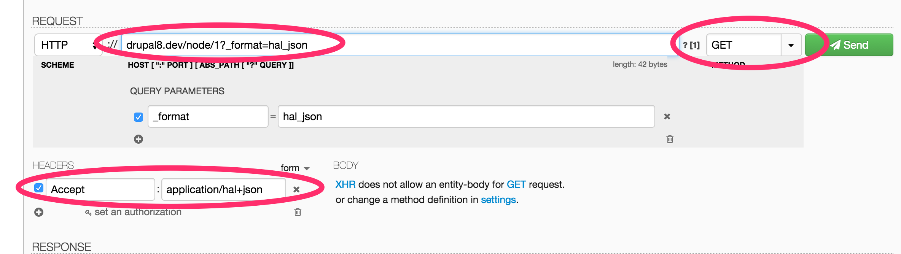

使用GET方法获取内容实体的数据(REST)
======================

使用下面的两步来暴露REST资源给GET请求:
1. Configuration
2. 测试Get请求

## Configuration
下面是一个简单请求配置示例:
```
resources:
  entity:node:
    GET:
      supported_formats:
        - hal_json
      supported_auth:
        - basic_auth
        - cookie
```

2. 测试Get请求
CURL
`curl http://localhost:8181/node/1?_format=hal_json`

Guzzle
```
$response = \Drupal::httpClient()
  ->get('http://example.com/node/1?_format=hal_json', [
    'auth' => ['username', 'password'],
  ]);

$json_string = (string) $response->getBody();
```

jQuery
```
jQuery.ajax({
  url: 'http://example.com/node/1?_format=hal_json',
  method: 'GET',
  success: function (comment) {
    console.log(comment);
  }
});
```

Dev HTTP Client
使用浏览器的扩展`DEV HTTP Client`[google]来测试。
