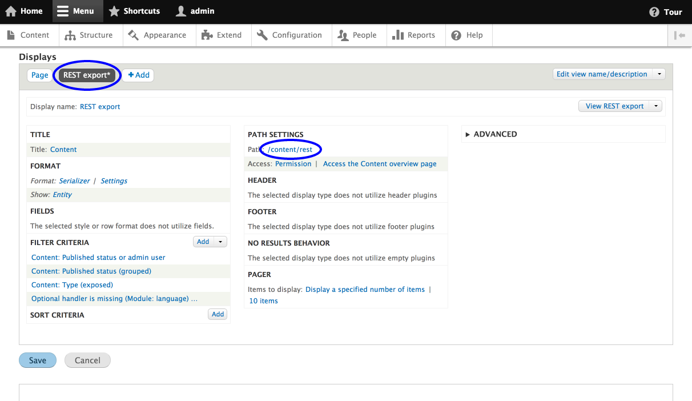
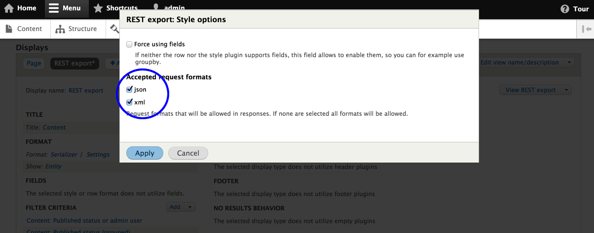

从视图生成列表获取资源
===================

RESTful资源输出可以把实体列表按照不同格式序列化再输出。
注意:REST导出插件不使用REST资源插件。REST定义的权限不适用于视图。

1. 确保已启用rest模块和序列化模块。
2. 创建视图并添加REST导出显示。确保添加一个导出路径。您将使用此路径访问JSON/XML数据。

3. 在序列化输出格式中设置请求格式。
