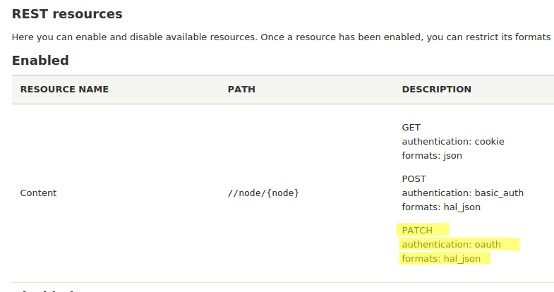
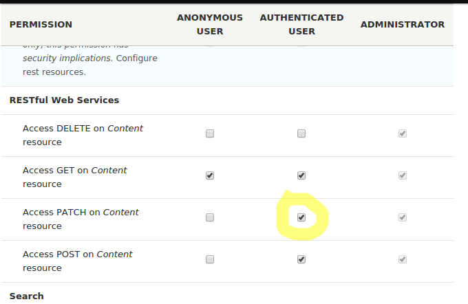
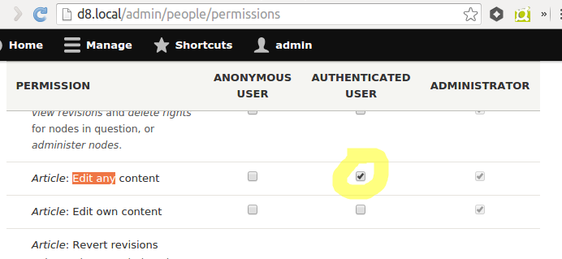
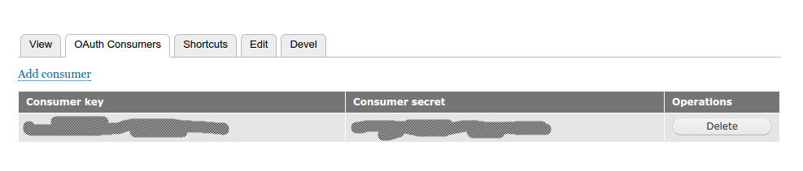
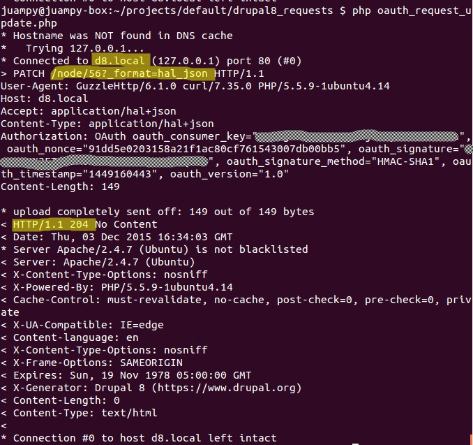

OAuth 更新示例
==============

本例演示了如何使用OAuth更新Node.
## 安装REST
你需要通过REST UI来添加Oauth认证来执行PATCH方法。可以以这个地址进行查看`admin/config/services/rest`。



然后，需要为待认证的用户调整相应的权限，赋予用户查看node的权限。

## 调整权限 
你需要给待认证用户PATCH节点的权限，并且支持用户编辑Node,下面是这两个的截图:





最后，你需要安装Oauth认证。

## 安装OAuth
关于OAuth的安装手册，请参看[OAuth页面](https://www.drupal.org/node/2110825). 一旦你为用户创建了键，你可以在用户的个人中心
查看到。然后，用户就可以使用认证密钥了。


## 更新节点
下面是例子：

```
require 'vendor/autoload.php';

use GuzzleHttp\Client;
use GuzzleHttp\HandlerStack;
use GuzzleHttp\Subscriber\Oauth\Oauth1;

$stack = HandlerStack::create();

$middleware = new Oauth1([
  'consumer_key'    => 'yourconsumerkey',
  'consumer_secret' => 'yourconsumersecret',
]);
$stack->push($middleware);

$client = new Client([
  'base_uri' => 'http://d8.local',
  'handler' => $stack,
]);

// Prepare the entity data.
$serialized_entity = json_encode([
  'title' => [['value' => 'Updated node title']],
  'type' => [['target_id' => 'article']],
  '_links' => ['type' => [
      'href' => 'http://d8.local/rest/type/node/article'
  ]],
]);

$response = $client->patch('node/56?_format=hal_json', [
  'auth' => 'oauth',
  'headers' => [
    'Accept' => 'application/hal+json',
    'Content-Type' => 'application/hal+json',
  ],
  'body' => $serialized_entity,
  'debug' => true,
]);
```
下面是完整的响应内容界面:



## 更新用户
下面是一个使用hal_json格式的例子:

```
$serialized_entity = json_encode([
  "_links": {
    "type": {
      "href": "http://d8/rest/type/user/user"
    }
  },
  "mail": [{
    "value": "marthinal@drupalisawesome.com"
  }],
  "pass": [{
    "existing": "existingSecretPass",
    "value": "myNewSuperSecretPass"
  }],
]);
```