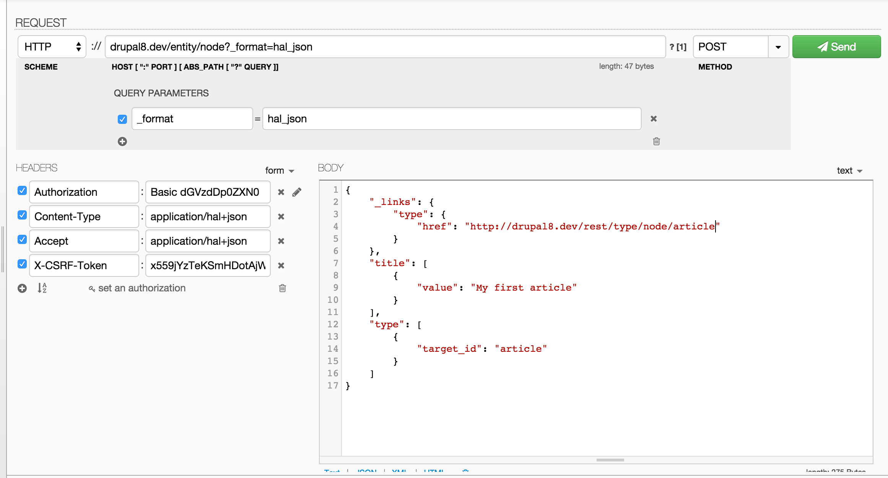

使用POST创建内容实体数据 RESTful
======================

使用下面的两步来暴露REST资源给POST请求:
1. Configuration
2. 测试Get请求

## 配置
```
resources:
  entity:node:
    GET:
      supported_formats:
        - hal_json
      supported_auth:
        - basic_auth
        - cookie
    POST:
      supported_formats:
        - hal_json
      supported_auth:
        - basic_auth
        - cookie
```

## 测试POST请求
在本例中使用`HAL+JSON`格式，`HAL+JSON`包含关系概念。Drupal中的大多内容都包含关系概念。确认关系在合适的时候加载，这个关系通常在(_links)键下。

例如，如果你想POST一个新的评论，你需要一个`_links`条目指向用户和评论所对应的实体. 最好的方法是首先获得一个例子并研究它的`_links`。

绝不POST一个UUID(或node id/ comment id/ ... ) 来创建新的实体。

在下面的实例中，都提交到`/entity/node`。大于8.3.0的版本，可以直接提交到`/node`，但是`/entity/node`依赖有效，直到Drupal 9才失效。

CURL(命令行)
```
curl --include \
  --request POST \
  --user klausi:secret \
  --header 'Content-type: application/hal+json' \
  --header 'X-CSRF-Token: <obtained from http://example.com/rest/session/token>' \
  http://example.com/entity/node?_format=hal_json \
  --data-binary '{"_links":{"type":{"href":"http://example.com/rest/type/node/article"}},"title":[{"value":"Example node title"}],"type":[{"target_id":"article"}]}'
```

Guzzle
```
<?php
$serialized_entity = json_encode([
  'title' => [['value' => 'Example node title']],
  'type' => [['target_id' => 'article']],
  '_links' => ['type' => [
      'href' => 'http://example.com/rest/type/node/article'
  ]],
]);

$response = \Drupal::httpClient()
  ->post('http://example.com/entity/node?_format=hal_json', [
    'auth' => ['klausi', 'secret'],
    'body' => $serialized_entity,
    'headers' => [
      'Content-Type' => 'application/hal+json',
      'X-CSRF-Token' => <obtained from /rest/session/token>
    ],
  ]);
?>
```

jQuery
```
function getCsrfToken(callback) {
  jQuery
    .get(Drupal.url('rest/session/token'))
    .done(function (data) {
      var csrfToken = data;
      callback(csrfToken);
    });
}

function postNode(csrfToken, node) {
  jQuery.ajax({
    url: 'http://example.com/entity/node?_format=hal_json',
    method: 'POST',
    headers: {
      'Content-Type': 'application/hal+json',
      'X-CSRF-Token': csrfToken
    },
    data: JSON.stringify(node),
    success: function (node) {
      console.log(node);
    }
  });
}

var newNode = {
  _links: {
    type: {
      href: 'http://example.com/rest/type/node/article'
    }
  },
  type: {
    target_id: 'article'
  },
  title: {
    value: 'Example node title'
  }
};

getCsrfToken(function (csrfToken) {
  postNode(csrfToken, newNode);
});
```
注意：如果使用基本授权，您需要设置“授权”头，下面是一个示例：
```
function formatBasicAuth(userName, password) {
  var basicAuthCredential = userName + ":" + password;
  var bace64 =  btoa(basicAuthCredential);
  return 'Basic ' + bace64;
}

// then in your post
var basic = formatBasicAuth('userName', 'password');
...

'X-CSRF-Token': csrfToken,
'Authorization': basic,
```
注意如果有问题你可能还需要检查你的CORS（Cross-Origin Resource Sharing跨域资源共享）在sites/default/services.yml和只有在开发环境下才能改变它的设置如下..
但记得在生产环境中关闭。
```
   # Configure Cross-Site HTTP requests (CORS).
   # Read https://developer.mozilla.org/en-US/docs/Web/HTTP/Access_control_CORS
   # for more information about the topic in general.
   # Note: By default the configuration is disabled.
  cors.config:
    enabled: true
    # Specify allowed headers, like 'x-allowed-header'.
    allowedHeaders: ['*']
    # Specify allowed request methods, specify ['*'] to allow all possible ones.
    allowedMethods: ['*']
    # Configure requests allowed from specific origins.
    allowedOrigins: ['*']
    # Sets the Access-Control-Expose-Headers header.
    exposedHeaders: false
    # Sets the Access-Control-Max-Age header.
    maxAge: false
    # Sets the Access-Control-Allow-Credentials header.
    supportsCredentials: false
```

Dev HTTP client



POST with Taxonomy Term entity reference using HAL+JSON: cURL (command line)|使用HAL+JSON来创建术语实体
下面是一个使用hal+json创建一个文章节点的POST请求示例，该节点具有一个“Tag”词汇表的分类术语实体引用。

这个例子只适用于hal+json，因为嵌入的概念特定于hal+json，所以它不存在于json或xml中。

当使用hal+json格式发布带有标记的文章节点之前，
首先必须以检索其uuid获取Tag（因为hal+json需要由uuid引用）。
如果这是一个新术语，你必须先使用POST创建它。另请参见示例“创建术语”。

```
curl --request POST -k -i -s --user user:password --header 'Content-type: application/hal+json' -H 'Cache-Control: no-cache' --header 'X-CSRF-Token: <obtained from http://example.com/rest/session/token>' 'http://example.com/entity/node?_format=hal_json' --data-binary '
{
  "_links": {
    "type": {
      "href": "http://example.com/rest/type/node/article"
    },
    "http://example.com/rest/relation/node/article/field_tags": {
       "href": "http://example.com/taxonomy/term/1?_format=hal_json"
    }
  },
  "type": {
      "target_id": "article"
    },
  "title": {
      "value": "My Article"
    },
  "body": {
      "value": "some body content aaa bbb ccc"
  },
    "_embedded": {
      "http://example.com/rest/relation/node/article/field_tags": [
        {
          "_links": {
            "self": {
              "href": "http://example.com/taxonomy/term/1?_format=hal_json"
            },
            "type": {
              "href": "http://example.com/rest/type/taxonomy_term/tags"
            }
          },
          "uuid": [
            {
              "value": "ff61ea71-2540-47fe-a4bb-384b12d4de47"
            }
          ],
          "lang": "en"
        }
      ]
    }
}'
```

POST New Taxonomy Term using HAL+JSON: cURL (command line)

Note: actual endpoint(真实地址) is '/entity/taxonomy_term/'
```
export JSON_DATA='
{
  "_links": {
    "type": {
      "href": "https://example.com/rest/type/taxonomy_term/tags"
    }
  },
  "vid": [
    {
      "target_id": "tags"
    }
  ],
  "name": [
    {
      "value": "RESTtag",
      "lang": "en"
    }
  ]
}'


curl --request POST \
  -k \
  -i \
  -s \
  --user "username:password" \
  --header 'Content-type: application/hal+json' \
  -H 'Cache-Control: no-cache' \
  --header "X-CSRF-Token: ####YourTokenHash####" \
  'https://example.com/entity/taxonomy_term/?_format=hal_json'  \
  --data-binary "$JSON_DATA"
```

POST new user with CURL request using Commandline:
```
curl --include --request POST --header 'Content-type: application/hal+json' http://localhost/xyz/web/user/register?_format=hal_json --data-binary '{"_links":{"type":{"href":"http://localhost/xyz/web/rest/type/user/user"}},"name":[{"value":"username"}],"mail":[{"value":"xyz@xyz.com"}],"pass":[{"value": "xyz"}]}'
```

