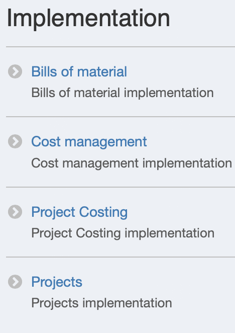

Markdown基础语法
===============

* [Wekipedia](https://en.wikipedia.org/wiki/Markdown)
* [PHPStorm中的Markdown参考](http://www.jetbrains.com/help/phpstorm/markdown.html)
* [Markdown官方语法](http://www.markdown.cn/#paragraphs-and-line-breaks)

##### 基础语法示例
* 表格(必须空行开头)

* 图片``

