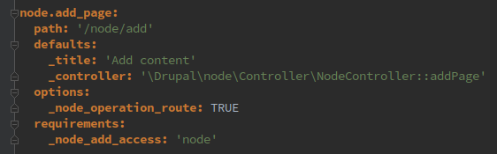
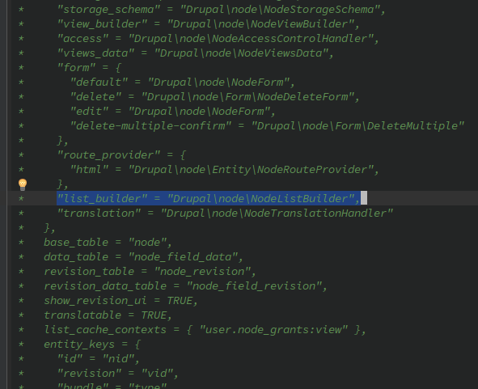
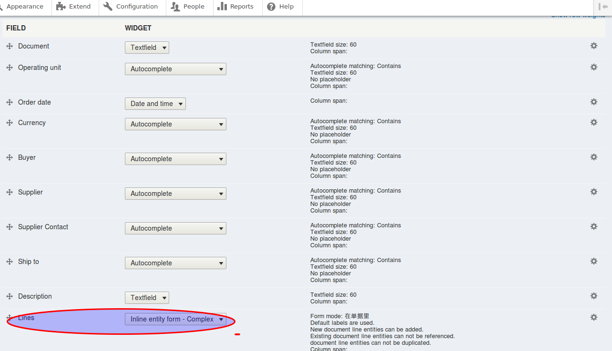
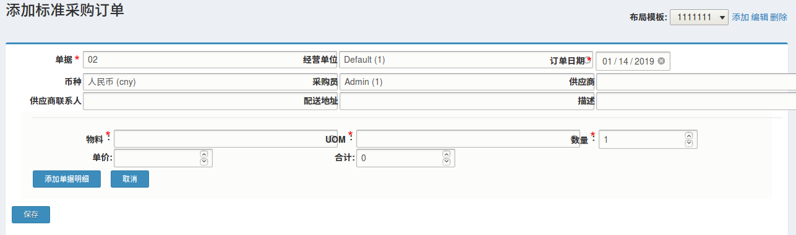

# 云平台开发方法

## 岗位及技能要求

### 前端控件开发
#### 职责：
1. 开发和优化前端控件
2. 开发和优化HTML、CSS、Javascript、模板、主题代码 
#### 技能要求：
1. 熟悉HTML、CSS、Javascript
2. 熟悉ES6
3. 熟悉Node.js、Yarn等工具使用
4. 熟悉平台模块、组件目录结构
### 平台代码开发
#### 职责：
1. 编写代码
2. 编写自动化测试用例
3. 运行自动化测试，并根据测试结果排错

### 业务模型设计
#### 职责：
1. 生成和维护实体对象设计和代码
技能要求：
1. 熟悉Oracle ERP系统的业务和设计
2. 熟悉模块和实体代码生成
3. 熟悉平台实体、字段等业务模型的代码维护

## 开发理念

## 基本概念
### Module(模块)
Module(模块)是可独立安装、卸载、升级、扩展的组件。  
每个模块是一个含有“[模块名].info.yml”文件的目录。  
核心模块在core/modules目录下；第三方模块在modules/contrib目录下；云平台的模块在modules/dsi目录下。
### CBO(Common Business Object)(公共业务对象)
每一个业务对象都是一个Module(模块)：

**公共业务对象:** 各应用系统共享的业务对象，只提供标准的业务处理，各应用系统可以在CBO基础上定制自己的业务处理。公共业务对象在modules/dsi/contrib目录下。
**行业业务对象:** 由公共业务对象扩展而来，行业内通用的业务对象。行业业务对象在modules/dsi/industries目录下。
**个性化模块:** 由公共业务对象或行业业务对象派生而来，专门为特定客户定制的模块，用于满足特定客户的个性化需求。

### Routing(路由)
Routing系统定义了如何响应Web服务器传过来的URL请求。
云平台的Routing系统基于Symfony框架。参考：https://symfony.com/doc/current/routing.html
各Module(模块)在“模块名.routing.yml”里定义路由。参考：core/modules/node/node.routing.yml



### Entity(实体)
实体是持久存储信息的对象。
实体分为ContentEntity(内容实体)和ConfigEntity(配置实体)。

**ContentEntity(内容实体)** 用于存储经常修改的信息，例如：BOM(物料清单)、Document(业务单据)、Item(物料卡片)等。

**ConfigEntity(配置实体)** 用于存储不常修改的信息，例如：ItemType(物料类型)、CostElement(成本要素)、Currency(币种)等。
每个实体都是特定**EntityType(实体类型)** 的实例。在/business_model/entity_type界面可浏览系统的EntityType。
某些ContentEntity具有子类型，称为**bundle** 。例如：DocumentType(单据类型)是Document(单据)的bundle；ItemType(物料类型)是Item(物料)的bundle；PersonType(人员类型)是Person(人员)的bundle。
不具备子类型的ContentEntity，也有一个bundle。例如：ItemLot(物料批次)具有唯一bundle为item_lot；Location(位置)具有唯一bundle为location。Overhead(费用)具有唯一bundle为overhead。

### Field(字段)
Field(字段系统)为entity(实体)提供自定义的数据字段，并负责存储、加载、编辑、呈现字段数据。

**Field type(字段类型):** 在core/lib/Drupal/Core/Field/Plugin/Field/FieldType目录可找到常用的字段类型，包括boolean(布尔值)、decimal(数值)、entity_reference(实体引用)、integer(整数)、string(字符串)等。
通过“find -path '*/Field/FieldType/*'”命令可找到所有的字段类型。

**Widget(表单器件):** Widget用于指定字段在编辑表单中的显示方式。在core/lib/Drupal/Core/Field/Plugin/Field/FieldWidget目录可找到常用的widget，包括checkbox(复选框)、entity_reference_autocomplete(带自动补齐功能的选择框)、number(数值输入框)、options_select(下拉选择框)、string_textfield(文字录入框)。
通过“find -path '*/Field/FieldWidget/*'”命令可找到所有的widget。

**Formatter(格式化器):** Formatter用于制定字段在entity显示时的显示方式。在core/lib/Drupal/Core/Field/Plugin/Field/FieldFormatter目录可找到常用的formatter。
通过“find -path '*/Field/FieldFormatter/*'”命令可找到所有的formatter。

### Render数组
Render数组是结构化的HTML标签。

编写程序是要避免直接输出HTML标签，应输出Render数组 , 好处是后续便于维护

错误的写法：
`$link = ‘<a href=”’ . Url::fromRoute(‘goto.google’)→toString() . ‘”>谷歌</a>’;`

正确的写法：
```
$[‘link’] = [
  ‘#title’ => ‘谷歌’,
  ‘#type’ => ‘link’,
  ‘#url’ => Url::fromRoute(‘goto.google’),
];
```
例如：编辑框
```
$[‘name’] = [
  ‘#title’ => ‘名称’,
  ‘#type’ => ‘textfield’,
];
```
例如：链接组
```
$[‘links’] = [
  ‘#theme’ => ‘links’,
  ‘#links’ => [
    ‘add’ => [
      ‘title’ => ‘添加’,
      ‘url’ => Url::fromRoute(‘item.add_page’),
    ],
    ‘edit’ => [
      ‘title’ => ‘编辑’,
      ‘url’ => Url::fromRoute(‘item.edit_form’, [‘item’ => $id]),
    ],
    ‘delete’ => [
      ‘title’ => ‘删除’,
      ‘url’ => Url::fromRoute(‘item.delete’, [‘item’ => $id]),
    ],
  ],
];
```
例如：表格
```
$[‘table’] = [
  ‘type’ => ‘table’,
  ‘header’ => [‘编号’，‘名称’，‘描述’],
  '#rows' => $rows,
  '#attributes' => [
    'id' => $table_id,
    'class' => ['field-multiple-table'],
  ],
]
```

参考: drupal_common_theme

### Cache(缓存)
系统为配置、定义、实体、Render数组、表单、视图、网页等都提供了缓存，当内容变化后会自动清除缓存。

**Cache tags(缓存标签):** 用于标识缓存项目中包含什么数据。一个缓存项可有多个标签。缓存标记用于解决缓存失效问题。

**Cache contexts(缓存上下文)：**


## 开发方法
### Module(模块)和Entity(实体)生成
Module(模块)就是含有“模块名称.info.yml”文件的目录，可以手工添加模块目录和文件。一般是通过命令生成模块目录和文件：vendor/bin/drupal gm

Entity(实体)分为Content entity(内容实体)和Config entity(配置实体)。通过“vendor/bin/drupal geco”命令可生产内容实体代码，通过“vendor/bin/drupal gec”命令可生成配置实体代码
### Entity(实体)list(列表)开发
在entity(实体)定义里指定list builder(列表构造器)：



为列表添加Operation(操作)按钮：在实体构造器类里

### Form(表单)开发
1)编写Form的Class(类)，参考CronForm.php

2)显示Form
方法一：直接在routing.yml(路由定义文件)里通过_form配置Routing(路由)。参system.routing.yml
方法二：在Controll里通过FormBuilder返回Form的Render数组。参考LocaleController::translatePage()
考
### 卡片开发
创建实体对象后，系统已自动提供了实体的编辑表单(卡片)。
在 “业务模型→ 字段管理”里可对卡片进行配置。
对现有卡片进行扩展：

1）为卡片提供新的按钮：编辑模块的links.action.yml文件配置新的按钮。

2）AJAX 联动：编辑实体表单类，实现联动。参考ItemRollupForm.php
```
$form[‘item’] = [

  '#title' => $this->t('Item'),
  
  '#type' => 'entity_autocomplete',
  
  '#target_type' => 'item',
  
  '#required' => TRUE,
  
  '#ajax' => [
  
    'callback' => '::itemSwitch',
    
    'event' => 'change',
    
    'wrapper' => 'revision-wrapper',
    
  ],
  
];

$form['item_revision'] = [

  '#title' => $this->t('Revision'),
  
  '#type' => 'select',
  
  '#required' => TRUE,
  
  '#prefix' => '<div id="revision-wrapper">',
  
  '#suffix' => '</div>',
  
];
```
### 单据开发
  单据是一类特殊的卡片，开发方法与卡片类似。区别是单据体是通过卡片的inline_entity_form_complex表单器件提供的。
  
  首先进入地址localhost:8181/document/type/,然后选择需要的单据类型(比如我们选择po_standard)的操作(operations)下面的管理表单显示(Manage form display)
  
  打开如下图：
  
  
  
  其中字段(Field)表示卡片中的各字段,控件(widget)表示用在该字段上的器件,在设置订单明细(lines)时,器件选择'inline entity form-Complex'
  这样订单类型为po_standard的订单卡片就配置好了,输入地址localhost:8181/document/add/po_standard,打开如下图
  
  
  
## 扩展/定制开发
定制开发主要用于：

1、对CBO(公共业务对象)进行扩展。例如：category(物料分类)模块为item(物料)模块提供分类管理。

2、将CBO(公共业务对象)定制为行业业务对象或个性化应用。

### 为实体提供扩展字段
1）扩展基础字段

通过hook_entity_base_field_info钩子为其他模块的实体添加基础字段。通过hook_entity_base_field_info_alter钩子修改其他模块定义的实体字段。

2）扩展bundle字段

## 高级开发
### Plugin(插件)开发
要开发插件肯定先要从相关插件基类继承下来，然后实现其中的方法，比如字段类插件需要 继承 FieldPluginBase，参数类插件需要继承StringArgument,NumberricArgument等

### ThirdPartySetting(第三方设置)

### Condition(条件)
Condition(条件)是可配置、可根据上下文或定义进行判断的插件。
参考区块利用条件配置区块的可见性:

1）配置条件（参考BlockForm）：

第一步：通过ConditionManager::getFilteredDefinitions获得可用的condition插件。

第二步：通过Condition::buildConfigurationForm构造表单界面。

2）条件使用和判断（参考BlockAccessControlHandler）：

第一步：根据配置产生ConditionPluginCollection（参考\Drupal\block\Entity\Block::getVisibilityConditions）

第二步：通过ConditionAccessResolverTrait::resolveConditions进行条件判断。

## 环境配置
启动docker:
cd ~/src/eabax-docker/eabax_dev
docker-composer up -d

进入docker系统：
docker exec -it eabax_dev bash
